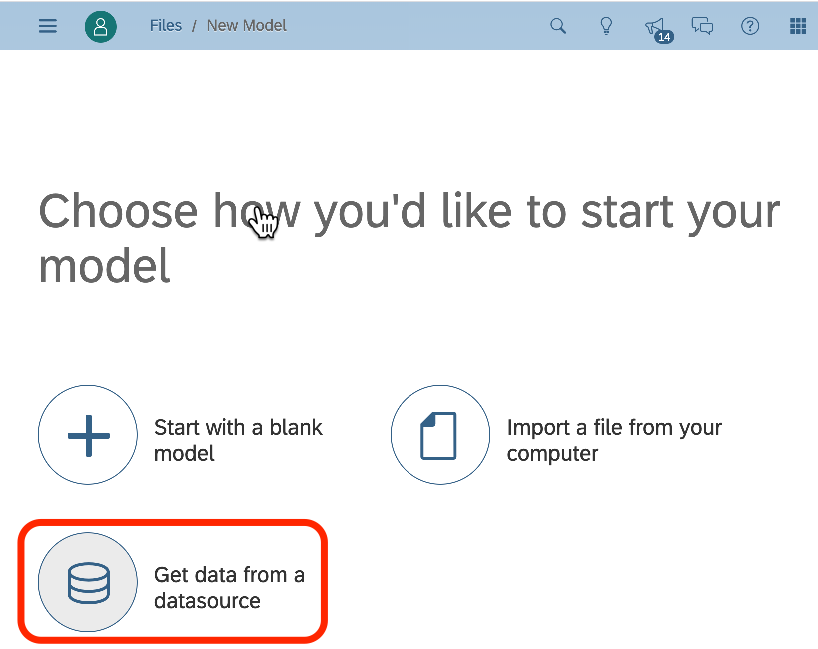

# generator-sap-a-team-haa 

> SAP A-Team HANA Analytics Adapter Project Generator

## Installation

First, install [Yeoman](http://yeoman.io) and generator-sap-a-team-haa using [npm](https://www.npmjs.com/) (we assume you have pre-installed [node.js](https://nodejs.org/)).

```bash
npm install -g yo
npm install -g generator-sap-a-team-haa
```

If you git clone this repo, get it to show up in Yeoman by using npm link from the repo directory. (sudo if perm issues)
```
npm link
sudo npm link
```
Yeoman looks for generators installed in:
```
cd /usr/local/lib/node_modules/
```

For SAP Application Studio (Beta).  Open a new terminal.
```
cd ~
mkdir generators
cd generators
git clone https://github.com/alundesap/generator-sap-a-team-haa.git
npm install -g generator-sap-a-team-haa
cd ~
cd projects
```

Then generate your new project:

```bash
yo sap-a-team-haa
```
You'll be greeted with the yeoman project prompt.  
```
     _-----_     ╭──────────────────────────╮
    |       |    │  Welcome to the awesome  │
    |--(o)--|    │  sap-a-team-haa project  │
   `---------´   │        generator!        │
    ( _´U`_ )    ╰──────────────────────────╯
    /___A___\   /
     |  ~  |     
   __'.___.'__   
 ´   `  |° ´ Y ` 

? Enter your project folder name (will be created if necessary). (git) 

```
Enter a new folder name where your project will be generated.
```
? Enter your project folder name (will be created if necessary). my_haa_project
```
Now give your project application a name.
```
? Enter your project application name. myhaa
```
The next set of prompts relate to a java module that will provide the actual InA interface.
There seem to be a lot of opportunities to to specify various things.  This is so that you can use a neomenclature that matches an existing project and therefore make it easier to merge this project with your existing one.  If you're just trying things out then you can safely accept the defaults provided.
```
? HAA module name(will provide the INA interface). (haa-ina) 
? HAA module path haa-java
```
The next module is a NodeJS application router.  You can inspect the project mta.yaml file to see how it's used and adapt it to your project.
```
? HAA router name(the application router). haa-web
? HAA router path haa-entry
```
You can pick one of two authorization models.  Dedicated is simpler and Shared allows for creation of roles.
```
? Pick an authorization model Dedicated(Stand-Alone) or Shared(Multi-Tenant). (Use arrow keys)
❯Dedicated 
  Shared 
? UAA resource name haa-uaa
? UAA service name HAA_UAA
```
Your project can access an existing HDI container or the generator can provide a new sample one for you.
```
? Do you want to include a new(sample) HDI container or use an existing HDI container? (Use arro
w keys)
❯ New HDI Container 
  Existing HDI Container 
? HDI resource name haa-hdi
Note, must match HDI resource name due to bug in WebIDE-FS calculation view editor.
 HDI service name. HAA_HDI
? DB Module Name. haa-hdb
? DB Module path. haa-db
```
It's important to understand that if you specify a schema name, then you may run into troubles when you deploy your project in multiple spaces using the same HANA instance.  However, specifying a schema name makes it easier to integrate with external systems.  By leaving the schema name blank, you are asking the deployer to create a unique one whenever necessary.
```
Leave this blank if you want the system to generate the schema name.
 DB Schema Name. (HAADB) 
```
The presumption is that you will be using this project to facilitate a HANA Live Connection from within SAP Analytic Cloud(SAC).  Enter your account name so that the CORS settings are correct.
```
? Your SAP Analytic Cloud Hostname ateam-isveng.us10.sapanalytics.cloud
```
Select the SCP landscape where you will be deploying this project.
```
Make sure that you are logged into the Cloud Foundry landscape before deploying.
 SAP Cloud Landscape. (Use arrow keys)
❯ US East (VA) AWS + trial = us10 
  US West (WA) Azu = us20 
  US Central (IA) GCP = us30 
  Europe (Frankfurt) AWS + trial = eu10 
  Europe (Netherlands) Azu = eu20 
  Japan (Tokyo) AWS = jp10 
  Japan (Tokyo) Azu = jp20 

```
While each SCP landscape comes with it's own default domain, you can also use your own if it's been set up ahead of time in th e org and space that you will using.  You can check for this with the command...
```
cf domains
```
Otherwise, just accept the default for the landscape.
```
? DNS Domain provisioned in your space. (cfapps.us10.hana.ondemand.com) 
```
Blah


```
? Subaccount's subdomain. mysubdomain
Make sure a HANA As A Service(HaaS) instance is available(or permitted) in this space before dep
loying.
 CloudFoundry space you're deploying into. (your_space) 
```
Blah
```


Make sure a HANA As A Service(HaaS) instance is available(or permitted) in this space before dep
loying.
 CloudFoundry space you're deploying into. dev
```
Blah
```
app name my_haa_project
Your project must be inside a folder named my_haa_project
I'll automatically create this folder.  Change into it with "cd my_haa_project"
   create .gitignore
   create README.md
   create mta.yaml
   create xs-security.json
...
   create haa-db/src/data/tempId.hdbsequence
   create haa-db/src/views/temps.hdbcalculationview
Your INA project is ready.
Change into your project folder with 'cd my_haa_project'
Run this command to build and deploy.
mkdir -p target ; mbt build -p=cf -t=target --mtar=haa-cf.mtar ; cf deploy target/haa-cf.mtar -f
```
Blah
```
C02XN22LJGH6:git i830671$ cd my_haa_project

```
Blah
```

mkdir -p target ; mbt build -p=cf -t=target --mtar=haa-cf.mtar ; cf deploy target/haa-cf.mtar -f


```


## License

MIT © [Andrew Lunde](https://github.com/alundesap)





